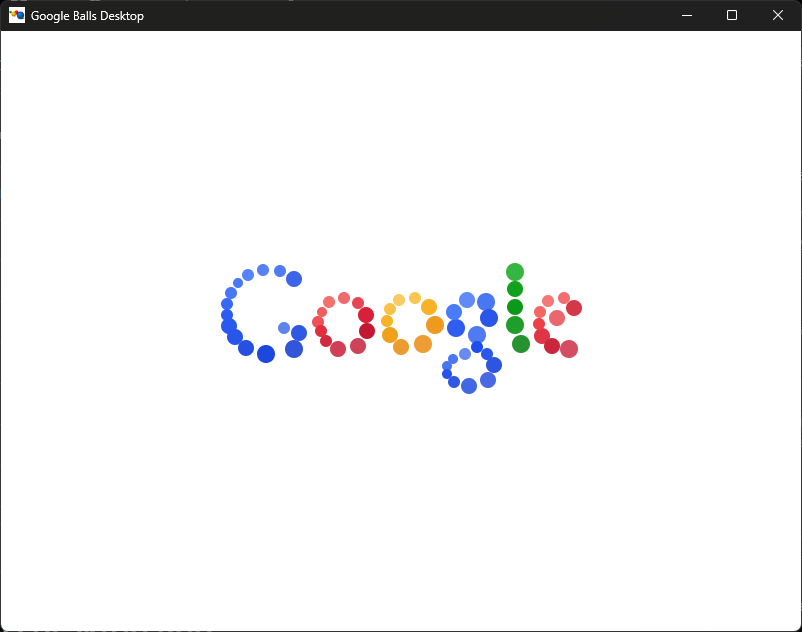

# google balls app!!!

google balls!! that one doodle from 2010! yeah its a desktop app

# Credits!
Google for making the original doodle back in 2010!

[Rob Hawkes](https://github.com/robhawkes) for making the remake of the doodle that this project uses as a base!

# Available in 4 flavors!
We have:
- Electron (the og but bulky) - Windows, Linux, macOS
- Tauri (like electron but not bulky) - Windows, Linux
- SDL2 (it's sdl2 google balls!) - Windows, Linux
- GTK3 (made in gtk3! personally my favourite) - Windows, Linux
- iOS (its only for iOS, lol. does use a webview) - iOS

# How 2 download:
If you want release buids, go to the releases and download the one you want! for the latest builds, click that actions tab, pick the latest build action and download the artifact u need

# How 2 compile electron
Go into ``electron`` run npm install and then you can do whatever you want it it like run it from source with ``npm start`` or build it with ``npm dist``

# How 2 compile tauri
Go into ``tauri`` and then ``npm install`` and then run ``npm run tauri build`` to build it or run ``cargo run --release
`` inside of ``src-tauri`` to run it!!!!!

# How 2 compile native
Go inside of ``native`` and if ur on windows you have to install msys and install gtk3 and make. for linux just install gtk3 and make. then run ``make``!

# How 2 compile gtk
Go inside of ``native`` and if ur on windows you have to install msys and install sdl2. for linux just install sdl2. on either os run .sh/.bat respectively.

