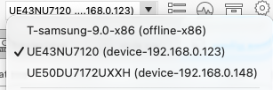

# Stable releases

### Windows
| Arch | Version | Link |
| :--- | :--- | :--- |
| x86_64 | GTK (tar.gz) | [Download](https://github.com/weeniemount/googleballs-app/releases/latest/download/gtk-app-windows-x64.tar.gz) |
| x86_64 | SDL (Native) | [Download](https://github.com/weeniemount/googleballs-app/releases/latest/download/googleballs-desktop-native.exe)
| x86_64 | Tauri (msi) | [Download](https://github.com/weeniemount/googleballs-app/releases/latest/download/Google.Balls.Desktop_1.0.0_x64_en-US-tauri.msi) |
| x86_64 | Tauri (exe setup) | [Download](https://github.com/weeniemount/googleballs-app/releases/latest/download/Google.Balls.Desktop_1.0.0_x64-setup-tauri.exe) |
| x86_64 | Electron (exe setup) | [Download](https://github.com/weeniemount/googleballs-app/releases/latest/download/Google.Balls.Desktop-electron.exe)
| x86_64 | Rust (Macroquad Native) | [Download](https://github.com/weeniemount/googleballs-app/releases/latest/download/native-rust-windows-latest.zip)

install instructions coming soon :bangbang:

### Linux
| Arch | Version | Link |
| :--- | :--- | :--- |
| x86_64 | GTK (tar.gz)  | [Download](https://github.com/weeniemount/googleballs-app/releases/latest/download/gtk-app-linux-x64.tar.gz) |
| x86_64 | SDL (Native) | [Download](https://github.com/weeniemount/googleballs-app/releases/latest/download/googleballs-desktop-native)
| x86_64 | Tauri (deb) | [Download](https://github.com/weeniemount/googleballs-app/releases/latest/download/Google.Balls.Desktop_1.0.0_amd64-tauri.deb)
| x86_64 | Tauri (rpm) | [Download](https://github.com/weeniemount/googleballs-app/releases/latest/download/Google.Balls.Desktop-1.0.0-1.x86_64-tauri.rpm)
| x86_64 | Tauri (AppImage) | [Download](https://github.com/weeniemount/googleballs-app/releases/latest/download/Google.Balls.Desktop_1.0.0_amd64-tauri.AppImage) |
| x86_64 | Electron (rpm) | [Download](https://github.com/weeniemount/googleballs-app/releases/latest/download/Google.Balls.Desktop-electron.rpm) |
| x86_64 | Electron (deb) | [Download](https://github.com/weeniemount/googleballs-app/releases/latest/download/Google.Balls.Desktop-electron.deb)
| x86_64 | Electron (AppImage) | [Download](https://github.com/weeniemount/googleballs-app/releases/latest/download/Google.Balls.Desktop-electron.AppImage)
| x86_64 | Rust (Macroquad Native) | [Download](https://github.com/weeniemount/googleballs-app/releases/latest/download/native-rust-ubuntu-latest.zip)

install instructions coming soon :bangbang:

### macOS
[Download .dmg](https://github.com/weeniemount/googleballs-app/releases/latest/download/Google.Balls.Desktop-electron.dmg)
NOTE: The macOS version is electron.

install instructions coming soon :bangbang:

### iOS
[Download .ipa](https://github.com/weeniemount/googleballs-app/releases/latest/download/Google.Balls-ios.ipa)
```
donate 100$ to me and google balls will be on the app store for a year
- ploszukiwacz 2025
```

install instructions coming soon :bangbang:

## Android
[Download .apk](https://github.com/weeniemount/googleballs-app/releases/latest/download/Google.Balls-signed.apk)

install instructions coming soon :bangbang:

## PSVita
[Download .self](https://github.com/weeniemount/googleballs-app/releases/latest/download/google_balls.self)
[Download .vpk](https://github.com/weeniemount/googleballs-app/releases/latest/download/google_balls.vpk)

idk your on your own gang

## 3DS
[Download .3dsx](https://github.com/weeniemount/googleballs-app/releases/latest/download/google-balls-3ds.3dsx)

idk your on your own gang

## Tizen TV:
[Download .wgt](https://github.com/weeniemount/googleballs-app/releases/latest/download/googleballs-app-unsigned.wgt)
Install Tizen Studio (And packages 8.0 Tizen (9.0 too if you want) and extension Samsung Certificate Extension & TV Extensions-9.0  
Import source code of Tizen version into Tizen Studio as a project (web project, not c/c++ project)
Create a certificate in Certificate Manager, and fill in the information. The onlything that matters is Version when you select the Distributor Certificate. Pick the one with "(Old)" if your TV is older than approximately 5 years old. Otherwise, do the "(New)" option.
Go to the directory of Tizen Studio (C:\tizen-studio\ or /Users/googleballsidkwhaturusernameis/tizen-studio
Go to the tools folder
Open a command line there
On your TV: 
### REMOTE WITH NUMBERS NEEDED
Go to the APPS section.
Go to the settings icon of the app store.
Press 1 2 3 4 5 on the remote.
A developer options menu will appear. 
Now, enable the developer options.
Enter in Local IP of your computer where it prompts you to.
Afer this, go to the Settings.
Go to Connection->Network->Network Status->IP Settings
You should see the local IP of the TV there in the IP adress field. Now remember that.

Back on your PC:
Now in that command line, enter either ./sdb connect (ip) or just sdb connect (ip)
After this, you will see the device appear on your emulators dropdown.




Select the TV with the IP you entered in to connect.
Then, click the play button
If you encounter an error within 58%, you are on your own here. I have no idea how to fix this, except if you did 8.0 (New) on an old tizen version TV, then make a new certificate using 7.0 (Old) as the version when selecting Distributor Certificate
Otherwise, you're good to go.

## Visual Studio Code
[Download .vsix](https://github.com/weeniemount/googleballs-app/releases/latest/download/googleballs-vscode-1.0.1.vsix) [Download from Extension Marketplace](https://marketplace.visualstudio.com/items?itemName=weeniemount.googleballs-vscode)

## UWP
[Download .appxbundle + .cer + Dependencies in a .zip](https://github.com/weeniemount/googleballs-app/releases/latest/download/GoogleBallsUWP_1.0.0.0_Test.zip)

you need to install the certificate to trusted root certification authorities/publishers (or whatever its called) on local machine and then install the dependencies inside of Dependencies/(your cpu architecture). then you can go back and install the appxbundle

## Windows Phone 8.1
[Download .xap](https://github.com/weeniemount/googleballs-app/releases/latest/download/Google.Balls_1.0.0.0_AnyCPU_wp8.appx)

you need to have a jailbroken windows phone for this and know how to flash xaps

## PSP
[Download EBOOT.PBP](https://github.com/weeniemount/googleballs-app/releases/latest/download/EBOOT.PBP)

you on your own gang

## webOS TV:
[Download .ipk](https://github.com/weeniemount/googleballs-app/releases/latest/download/com.weenie.googleballs_1.0.0_all.ipk)

You need ``npm``

Install the ares cli with this comand:
```bash
$ npm install -g @webos-tools/cli
```

### ON YOUR TV
Go install the Developer Mode application and log into your LG Developer account.

Finally enable Dev Mode, restart, and enable your Key Server.

### BACK TO YOUR PC

Now set up your TV for installation:
```bash
$ ares-setup-device

[you might have some other stuff]

** You can modify the device info in the above list, or add new device.
? Select add
? Enter Device Name: My TV
? Enter Device IP address: 192.168.1.234
? Enter Device Port: 9922
? Enter ssh user: prisoner
? Enter description: this is my tv
? Set default ? No
? Save ? Yes

[other stuff here]

** After adding your device, you\'ll need to get the key file from your webOS TV.
Follow these steps:
1. Ensure that the key server button in the Developer Mode app on your webOS TV is enabled.
2. Run the command "ares-novacom --device My TV --getkey" to retrieve the key file from your webOS TV.
3. Enter the passphrase displayed in the Developer Mode app into the prompt.
For more details, refer to the https://webostv.developer.lge.com/develop/getting-started/developer-mode-app

$ ares-novacom --device "My TV" --getkey
Passphrase: ABCDEF
```

Now just go install the ipk:

```bash
$ ares-install -d "My TV" com.weenie.googleballs_1.0.0_all.ipk
```

If this fails, you either typed your IP wrong, your passphrase was wrong, you forgot your key, or you didn't enable Dev Mode

# Nightly (actions)
Click that actions tab above, pick the latest build and download the artifacts you need